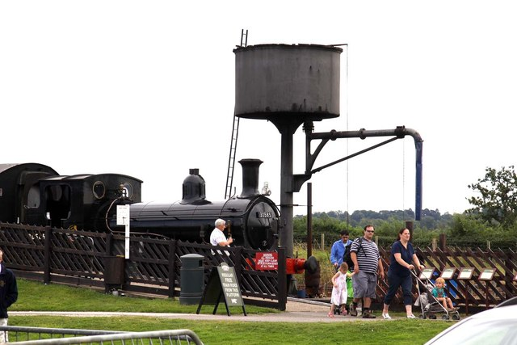

# watertower

`

Search Engine for Serverless environment.

* Search via words in documents
* Filter by tag

## Architecture

This API uses standard inverted index to achieve search. When searching, calculate score by TFIDF algorithm and sort.

This tool is using [gocloud.dev's docstore](https://gocloud.dev/howto/docstore/) as an storage.
So it can run completely managed environment (DynamoDB, Google Firestore, Azure CosmosDB) and MongoDB.

Elasticsearch can use flexible document, but this watertower can use only the following structure.
``"title"`` and ``"content"`` are processed (tokenize, stemming, remove stop words) by packages in ``github.com/future-architect/nlp``.
Now only English and Japanese are implemented.

```json
{
  "unique_key": "100",
  "lang": "en",
  "title": "100 Continue",
  "content": "This interim response indicates that everything so far is OK and that the client should continue the request, or ignore the response if the request is already finished."
}
```

## Basic usage

### Raw APIs

### HTTP handler

By default it registers only search API. To add register APIs, set ``true`` to ``EnableRegister`` field of opt.

## Sample Codes

### httpstatus in /cmd/httpstatus

CLI tool to search http status code. It reads from bundled documents and registeres them when booting.
It uses memdocstore as a backend datastore.

### watertower-web in /cmd/watertower-web

Simple web server that stores document and search.

## Development

## License

Apache2

